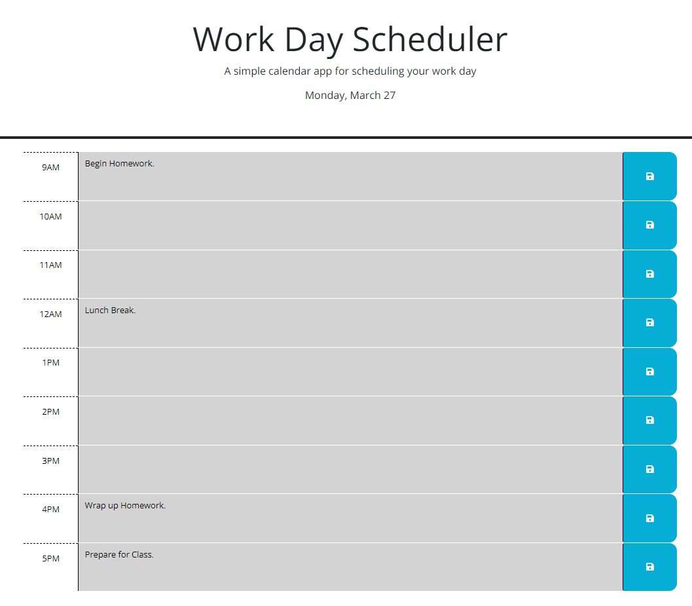

# 05 Third-Party APIs: Work Day Scheduler

## Description

This project provides rows for each hour of the average work day (9am-5pm) to schedule and save events inside of. Each row is color coded to match the current hour of the day, grey for past hours, red for current hours, and green for future hours. When a row is clicked, text can be input and saved to the local storage with the blue save button on the right. Previously input events will be remembered and displayed on the appropriate hour row.

[Deployed Application](https://emill004.github.io/05-Work-Day-Scheduler/)

